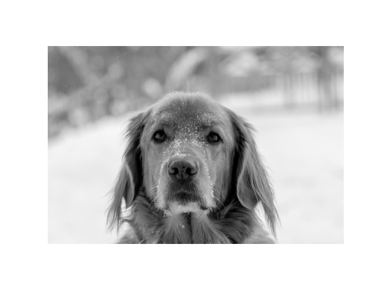
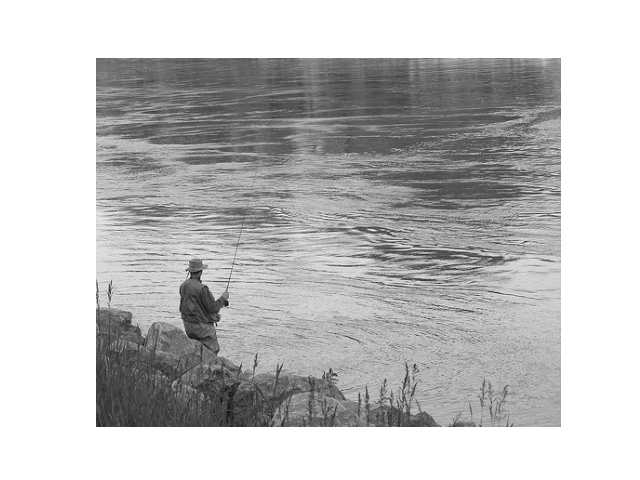
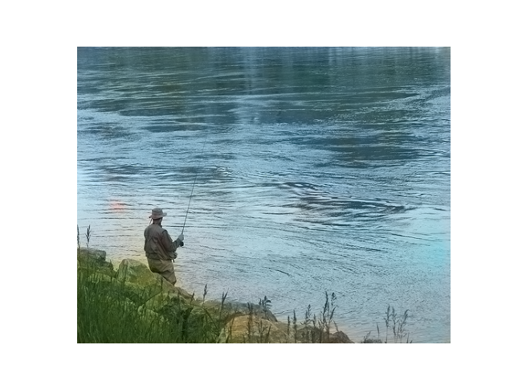
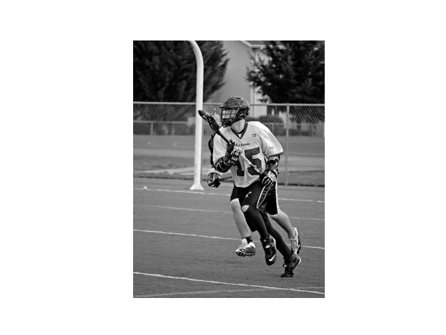
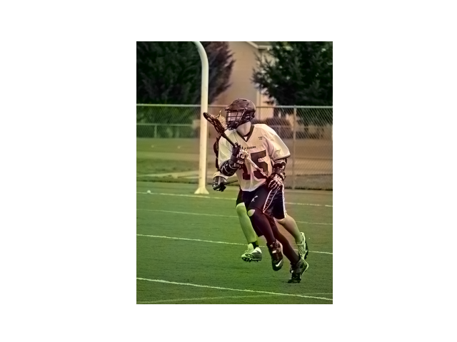

# 🎨 Colorful Image Colorization in PyTorch

This project is a full PyTorch reimplementation of the paper  
**[Colorful Image Colorization (Zhang et al., 2016)](https://arxiv.org/abs/1603.08511)**

It converts grayscale images into realistic color images using a CNN trained in the Lab color space, with color quantization and class rebalancing.

---

## 📌 Highlights

- ✅ Fully convolutional colorization network (`ColorizationNet`)
- ✅ Quantized ab color bins (313 classes)
- ✅ Class rebalancing with empirical frequency smoothing
- ✅ End-to-end training and inference support
- ✅ Trained on [Flickr8k dataset](https://www.kaggle.com/datasets/adityajn105/flickr8k)

---

## 📷 Example Results

| Input (Grayscale) | Output (Predicted RGB) |
|-------------------|------------------------|
|  |  |
|  |  |
|  |  |

---

## 📁 Folder Structure

```bash
.
├── model.py                        # Model 
├── dataset.py                      # dataset
├── color_quantizer.py              # ab colors quantizer
├── preprocessing.py                # Images preprocessing
├── train.py                        # Training loop
├── infer.py                        # Inference script
├── notebook.ipynb                  # Usage Example
├── weights/pts_in_hull.npy         # Precomputed ab bin centers (313 x 2)
├── weights/class_weights.npy       # Class rebalancing weights
├── examples/                       # Example input/output images
└── README.md
```
